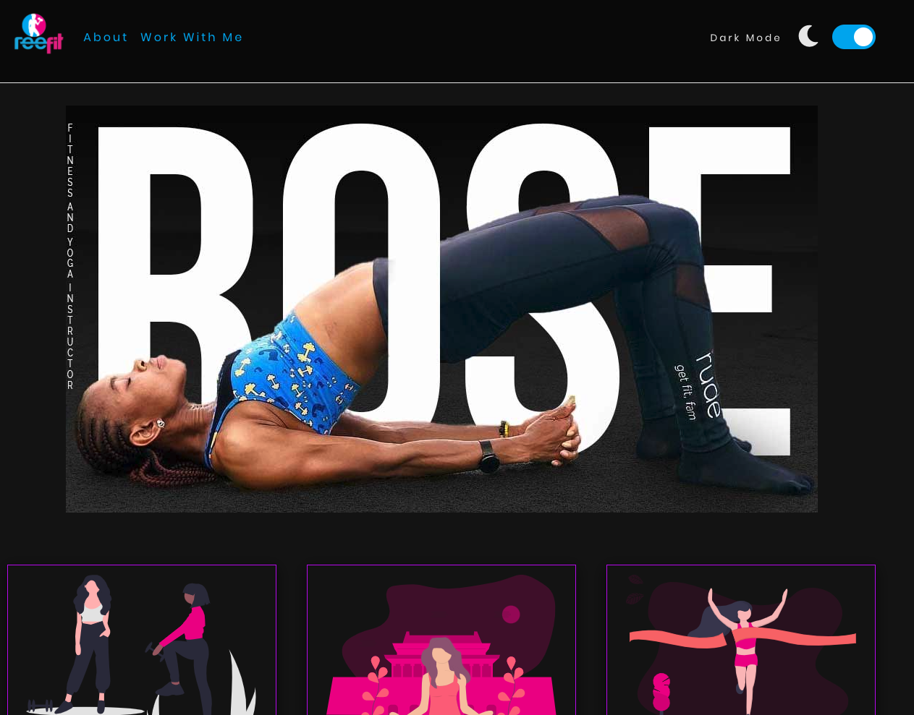

# REEFIT WEBSITE v1.0.0

Website showing the use of light/dark mode using vanilla JavaScript. This project is a one-pager that showcases what the client does. I also had to sketch the UI prototype on paper.

# Motivation for this project

The idea came about from the [JavaScript Web Projects: 20 Projects to Build Your Portfolio](https://academy.zerotomastery.io/p/javascript-projects). I encourage you to check it out.

# Mockup - Reefit

# Getting Started

You need to have basic understanding of HTML, CSS(Flexbox), and Javascript.

# Online Tools
Illustrations from [Undraw](https://undraw.co/illustrations)

Icons from [Fontawesome](https://fontawesome.com/)

Favicon generator [realfavicongenerator](https://realfavicongenerator.net/)

# Deployment

Github pages

Project [view]()

+ Clone the repo and contribute if you find this useful and definitely give it a star.
